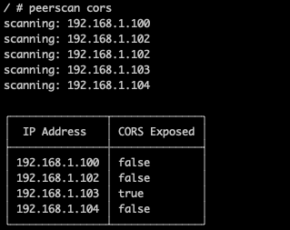

### IPFS Peer Scanner
-
:warning: 
This is DegreeWare! ie. Software created in the pursuit of a university degree. So, use at your own peril :)
:warning:

`peerscan` scans peers in an IPFS network for security (and hopefully in the future) general diagnostic information.

It's usage can be seen in [lab](https://github.com/sne-ot-research/ipfs-lab-environment) which is a docker compose 
that defines a private IPFS network. 

Using it to scan for peers with exposed CORS configuration looks like this:

#### TODO
- Add dns info scanning
- Add whois scan

